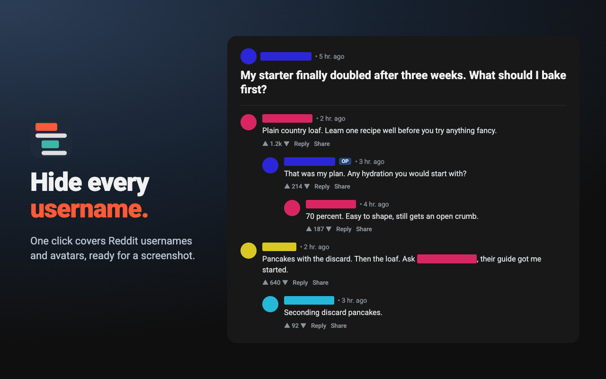
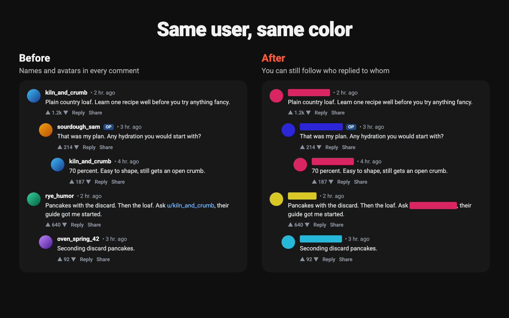
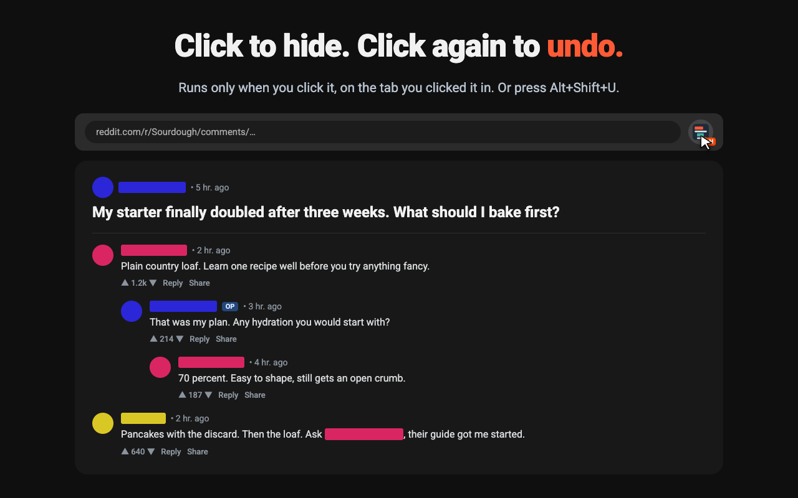

# Username Censor for Reddit

A Chrome extension that covers every username on a Reddit page with a color block, so you can share a screenshot without naming anyone.



Sharing a Reddit thread usually means opening an image editor and scribbling over each username by hand. Miss one and you have named someone who never agreed to be in your screenshot. This does all of them in one click.

## What it does

- Covers every username on the page with a solid color block.
- Hides avatars.
- Covers `u/` mentions inside comment text.
- Keeps covering new comments as you scroll or expand replies.
- Puts the page back when you click again.
- Works on new Reddit and old.reddit.com, in light and dark mode.

## Same user, same color

Each username hashes to one color. The same person has that color in every comment, so a reader can still follow who replied to whom.



Two users can land on similar colors. There are 360 hues and a busy thread has a lot of people in it.

## Use

1. Open a Reddit page.
2. Click the toolbar button, or press Alt+Shift+U.
3. Take your screenshot. The badge shows ON while usernames are hidden.
4. Click again to undo.



Change the shortcut at `chrome://extensions/shortcuts`.

## Limits

Check your screenshot before you post it. The extension covers names that link to a user profile, and nothing else.

- A username typed as plain text, without the `u/` prefix, stays visible.
- User flair stays visible.
- The block is as wide as the name, so it shows roughly how long the name is.

## Install from source

1. Clone this repo.
2. Open `chrome://extensions` and turn on Developer mode.
3. Click "Load unpacked" and pick the repo folder.

## How it works

`index.js` is the service worker. On a toolbar click it injects `censor.js` into the active tab and sets the badge.

`censor.js` does the work:

1. It finds every link whose path is `/user/<name>` or `/u/<name>`.
2. It hashes the lowercased name to a hue and paints the link and its text `hsl(<hue> 70% 50%)`. Fixed saturation and lightness keep the block visible on light and dark themes.
3. It hides any image inside the link, which is how avatars go.
4. It repeats this inside shadow roots, because new Reddit is built from web components.
5. A `MutationObserver` rescans when Reddit loads more comments.

Turning it off restores each element's original `style` attribute.

Matching on the link target instead of class names means one rule covers both Reddit front ends, and a Reddit redesign is less likely to break it.

## Privacy

The only permissions are `activeTab` and `scripting`. The extension has no access to any page until you click it, and then only to that tab. No analytics, no network requests, no storage. See [store/privacy.md](store/privacy.md).

## Repo layout

| Path | What it is |
| --- | --- |
| `manifest.json` | Manifest V3 config |
| `index.js` | Service worker, handles the toolbar click |
| `censor.js` | Script injected into the page |
| `icons/` | Extension icons, rendered from `store/src/` |
| `test/` | Playwright test and fixture pages |
| `store/listing.md` | Copy for each Chrome Web Store dashboard field |
| `store/privacy.md` | Privacy policy |
| `store/*.png` | Store screenshots and promo tiles |
| `store/src/` | SVG and HTML sources for the icons and store images |
| `store/render.sh` | Renders the icons and store images |
| `package.sh` | Builds the upload zip |

## Test

```sh
npm install
npx playwright install chromium
npm test
```

The test loads the extension in Chromium and toggles it on fixture pages served as reddit.com. Reddit blocks automated browsers, so the fixtures in `test/fixtures/` stand in for the live site. If Reddit changes its markup, update the fixtures to match.

## Publishing

1. Bump `version` in `manifest.json`.
2. Run `./package.sh`. It writes the upload zip to `dist/`.
3. Upload the zip in the Chrome Web Store developer dashboard.
4. Fill the dashboard fields from `store/listing.md`.

`./store/render.sh` re-renders the icons and store images after a change in `store/src/`. It needs Chrome and ImageMagick.

## License

MIT. Not affiliated with or endorsed by Reddit.
